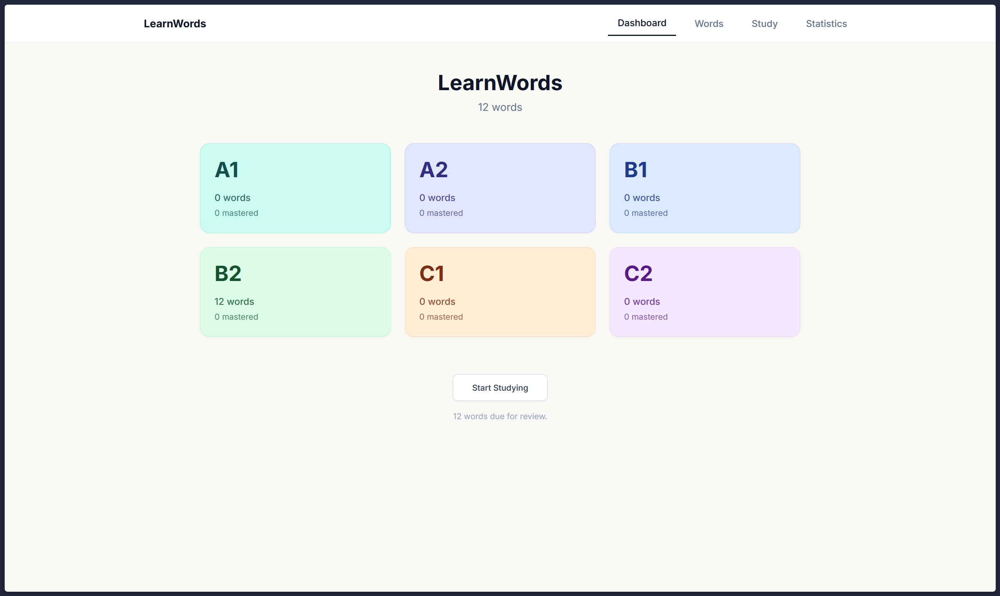
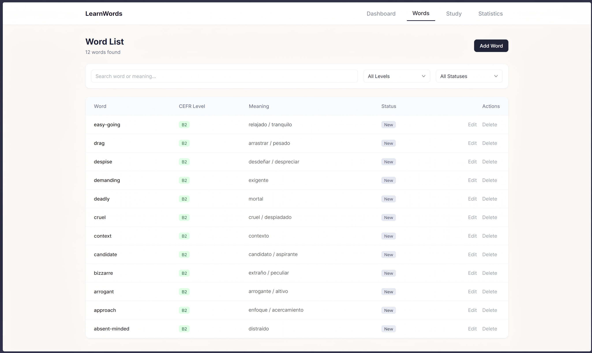
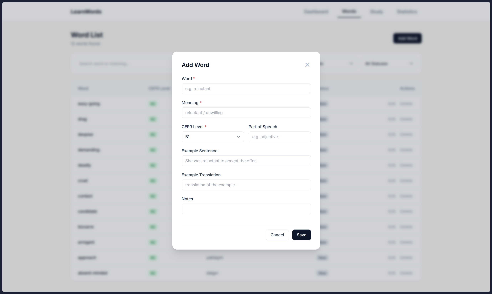
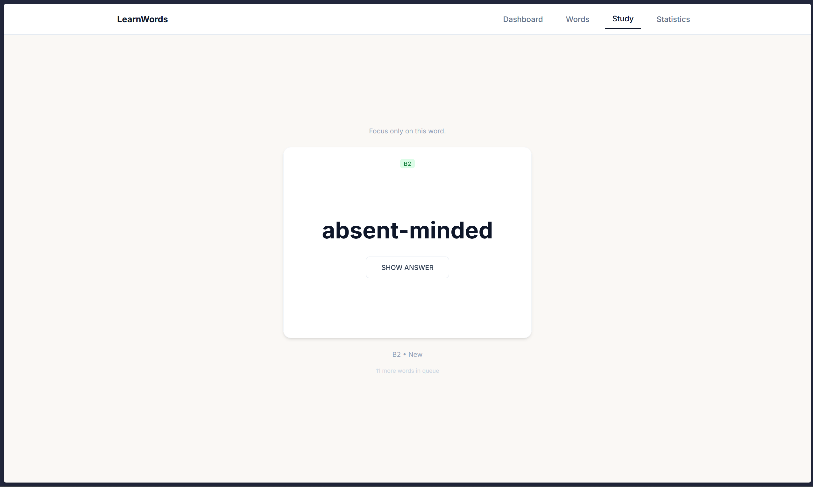
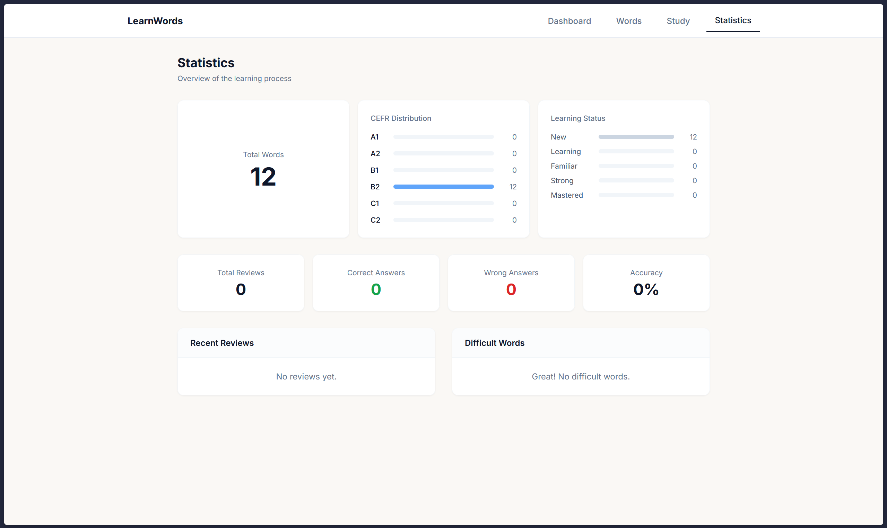

# LearnWords
**This site was created to help users memorize vocabulary using flashcards.**
Aditionally, this website was created using AI tools to help me learn to code with artificial intelligence.

**Dashboard**
The homepage displays word counts and “Start Studying” buttons.

**Words**
The Words page displays the words we have added and an “Add Word” button.

**Add Word**
In the word addition module, we can add the word itself, its meaning, CEFR level, part of speech, an example sentence, and its translation.

**Study**
On the Study page, the flashcards display the word itself on the front and its meanings on the back. This allows users to practice memorizing vocabulary.

**Statistics**
On the Statistics page, we can view statistics such as the number of words, CEFR level distribution, learning status, total views, total number of correct and incorrect answers, and accuracy rate.

# **Installation**
**Prerequisites**
- Node.js (https://nodejs.org/) v18 or later

**Installation**
Clone repository:
- `git clone https://github.com/bedwen/learnwords`
- `cd learnwords`
Install to packages:
- `npm install`

**How To Start Website**
To host the server locally:
- `npm run dev`
Go to the localhost address to open the website:
- `Open http://localhost:5173 in your browser.`

