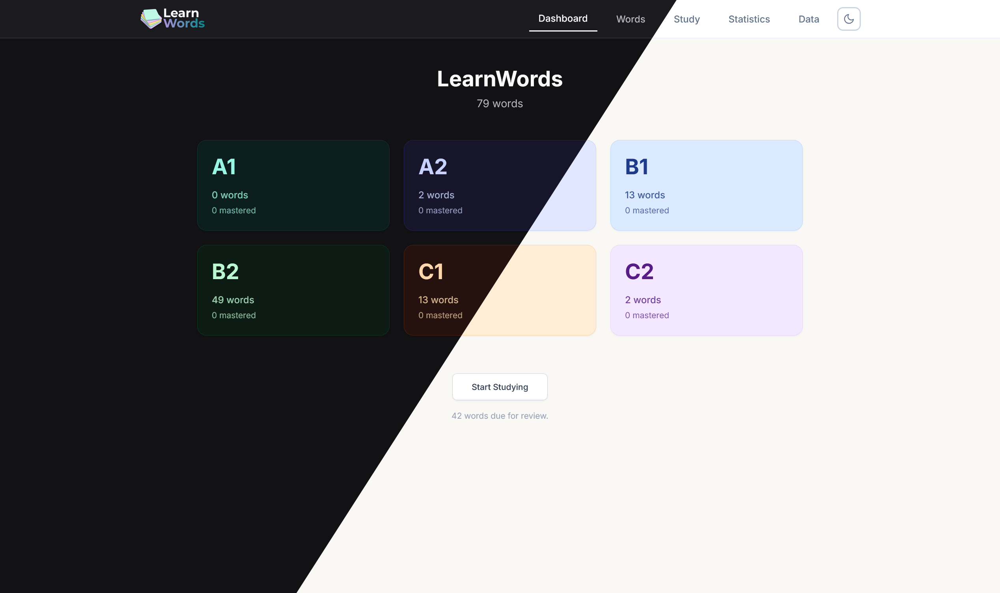
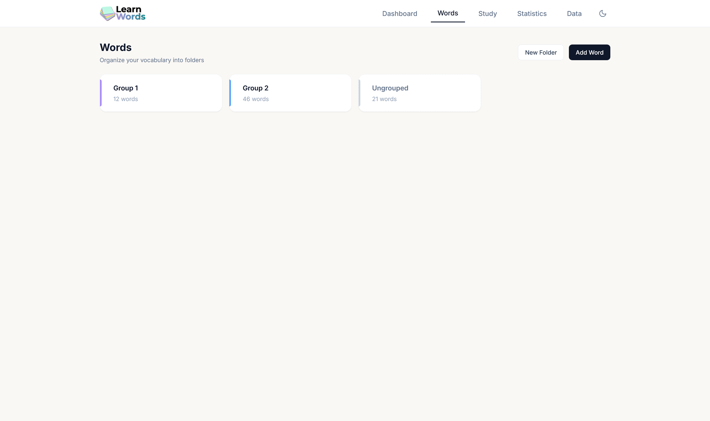
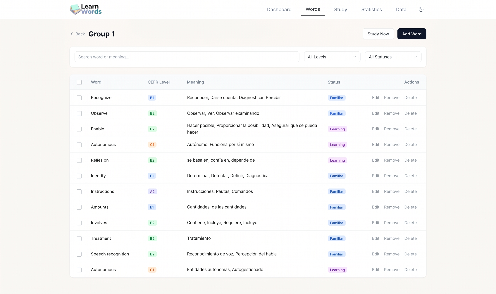
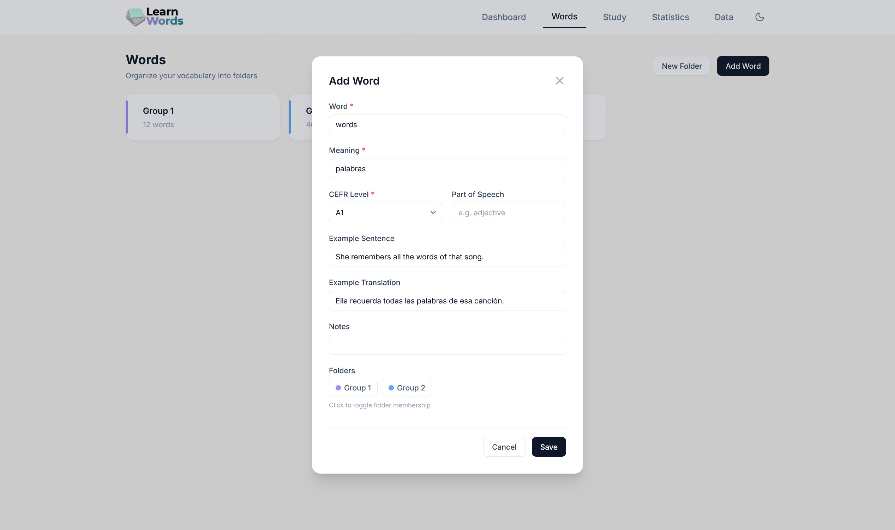
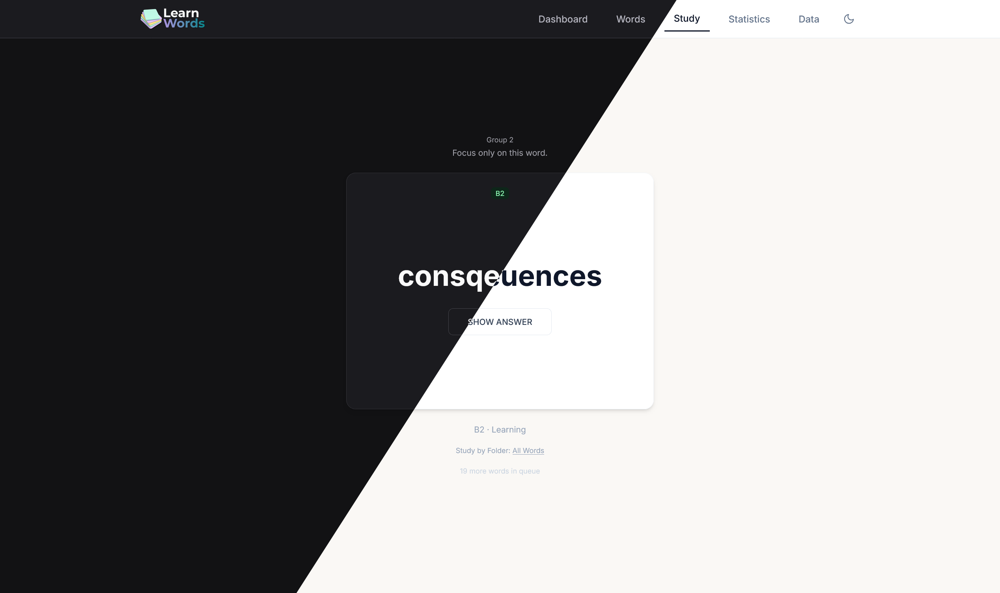
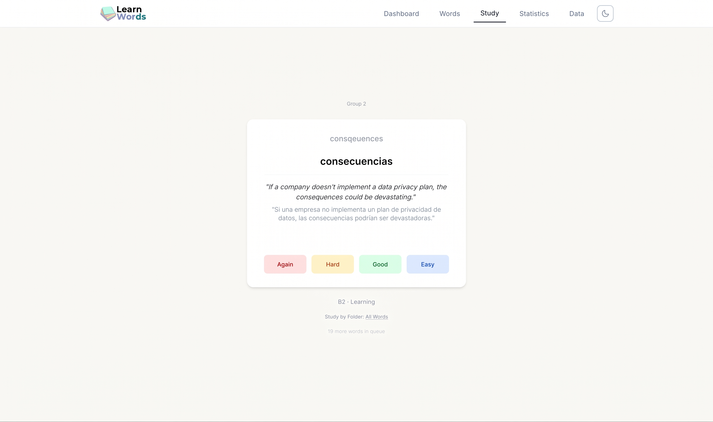
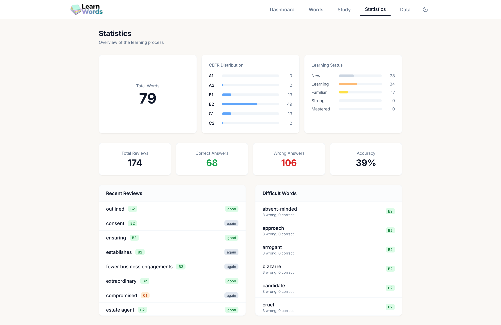
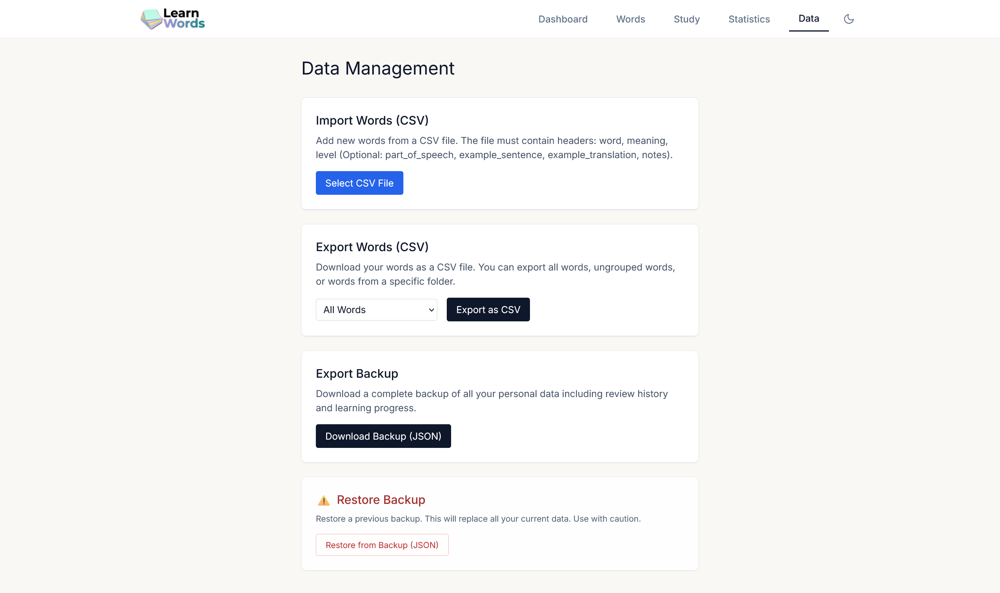

# LearnWords
**This site was created to help users memorize vocabulary using flashcards.**
Additionally, this website was created using AI tools to help me learn to code with artificial intelligence.

*LearnWords now has a dark mode feature!*

---
## **Dashboard**

The homepage displays word counts and “Start Studying” buttons.

---
## **Words**

The Words page lets you create groups and add words!

Groups keep the words you want together. You can select specific words within a group and move them to another group, change their CEFR levels all at once, or delete them entirely.

If you have a word that doesn’t belong to any particular group, no problem! There’s also an “ungrouped” group for those words.

---
## **Add Word**

In the word addition module, we can add the word itself, its meaning, CEFR level, part of speech, an example sentence, and its translation.

---
## **Study**

On the Study page, the flashcards display the word itself on the front and its meanings on the back. This allows users to practice memorizing vocabulary.

You can also see which group the word belongs to on the flashcard. By clicking the group name below the flashcard, you can switch to a different word group to study.

Powered by a Spaced Repetition System (SRS), the app automatically schedules when you should review each word based on your rating (Again, Hard, Good, Easy), helping you build long-term memory effortlessly.

---
## **Statistics**

On the Statistics page, we can view statistics such as the number of words, CEFR level distribution, learning status, total views, total number of correct and incorrect answers, and accuracy rate.

---
## **Data Management**

On the Data Management page, you can easily export your word lists or import new ones directly via CSV. You can also create complete JSON backups to keep your learning progress safe and restore them anytime!

---
## **Tech Stack**

- **Frontend:** React 18, TypeScript, Vite, Tailwind CSS
- **Backend:** Node.js, Express
- **Database:** SQLite (`better-sqlite3`)
- **Testing:** Vitest

---
## **Installation**
**Prerequisites**
- [Node.js](https://nodejs.org/) v18 or later

---
**Setup & Run**
Clone repository:

- `git clone https://github.com/bedwen/learnwords`
- `cd learnwords`
Install to packages:
- `npm install`

**How To Start Website**
To host the server locally:
- `npm run dev`
Go to the localhost address to open the website:
- `Open http://localhost:5173 in your browser.`
---
